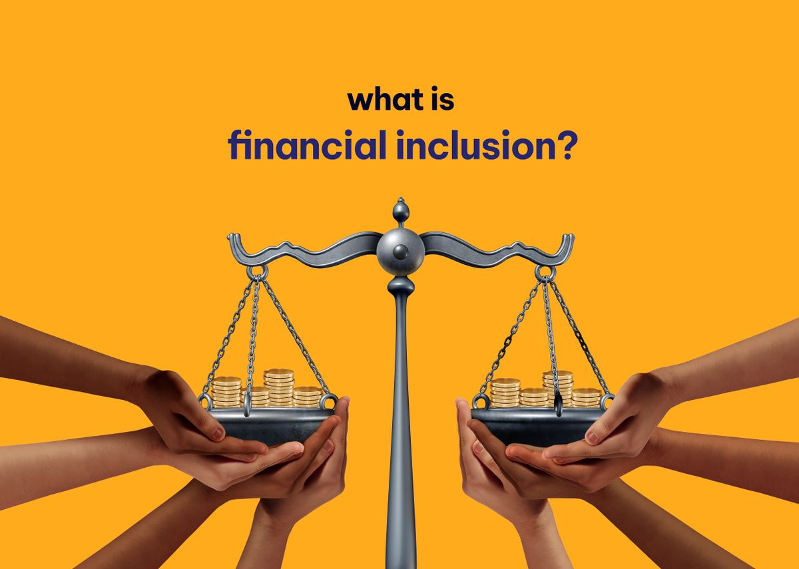
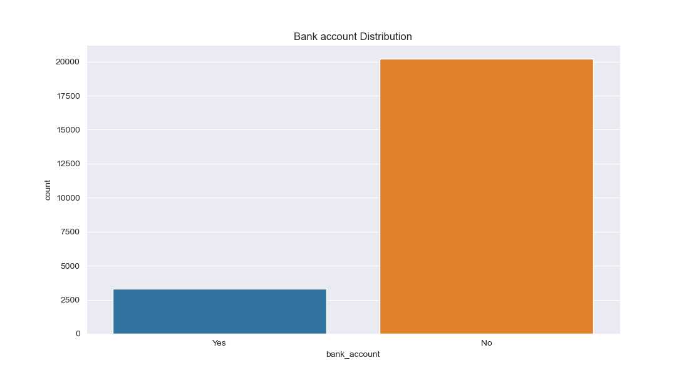
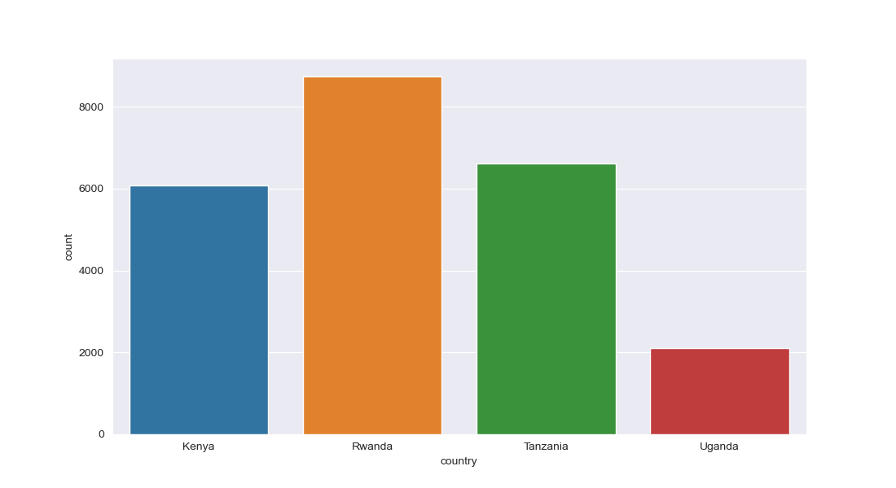
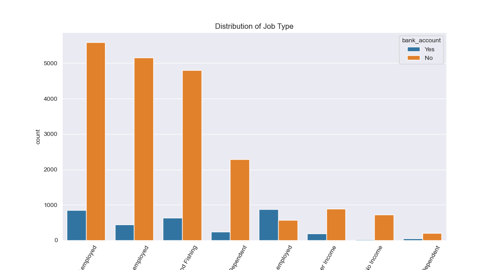
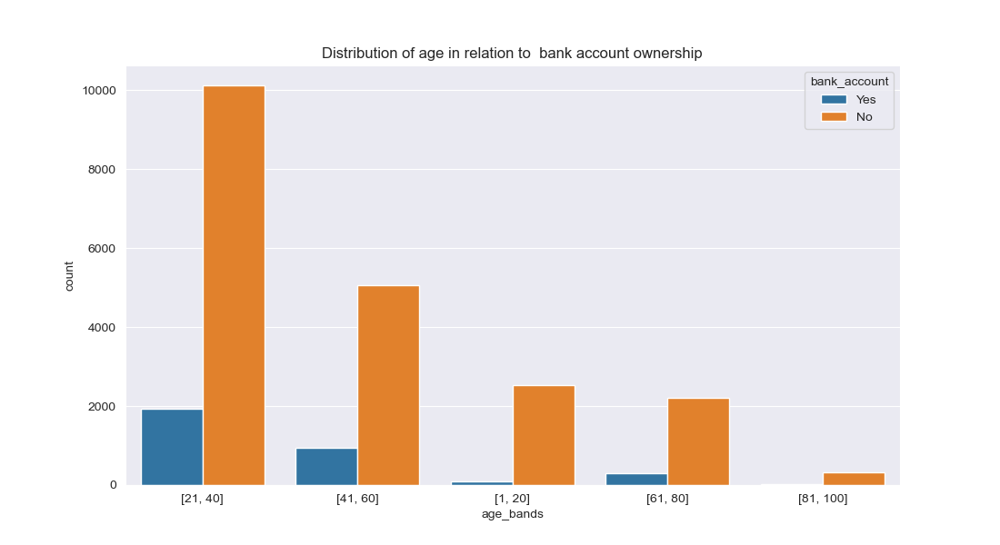

    <h1>Financial Inclusion in Africa</h1>
        

## Project Overview
Financial inclusion refers to the process of providing access to a range of financial services and products to individuals and communities, particularly those who are traditionally excluded from the mainstream financial system. Financial inclusion aims to promote financial stability, reduce poverty, and improve economic growth and development.

The financial services and products that are typically provided as part of financial inclusion include savings accounts, credit, insurance, and payment services. These services can be offered through traditional financial institutions, such as banks and credit unions, or through newer digital channels, such as mobile banking and fintech platforms.

## Business Problem
Financial inclusion remains one of the main obstacles to economic and human development in Africa. For example, across Kenya, Rwanda, Tanzania, and Uganda only 9.1 million adults (or 14% of adults) have access to or use a commercial bank account.

Traditionally, access to bank accounts has been regarded as an indicator of financial inclusion. Despite the proliferation of mobile money in Africa, and the growth of innovative fintech solutions, banks still play a pivotal role in facilitating access to financial services. Access to bank accounts enable households to save and make payments while also helping businesses build up their credit-worthiness and improve their access to loans, insurance, and related services. Therefore, access to bank accounts is an essential contributor to long-term economic growth.
  

### Main Objective

The main objective of this project is to create a machine learning model to predict which individuals are most likely to have or use a bank account. The models and solutions developed can provide an indication of the state of financial inclusion in Kenya, Rwanda, Tanzania and Uganda, while providing insights into some of the key factors driving individuals’ financial security.

### Specific Objectives

* To identify countries within Africa that have more bank accounts
* To identify which countries have fewer bank accounts
* To idenfiy the relationship between a bank account ownership and the location where an individual stays
* To identify the relationship between bank account ownership and the job type
* To investigate whether the education level affects the ownership of a bank account
* To investigate the distribution of bank account ownership with sex and age of individuals
* To investigate whether people with cell phones have bank accounts or not
* To investigate the relationship between household size and back account ownership

### Metric of Success

To build a model that accurately classifies an individual as having a bank account or not

### Experimental Design

Below is the expected workflow:
*   Loading our libraries and dataset
*	Data Cleaning and preparation	
        *	Dealing with missing values
        *	Dealing with duplicates
*	Performing EDA
        *	Univariate Analysis
        *	Bivariate Analysis
*	Feature Engineering
*	Modeling
*	Performance Evaluation
*	Performance Analysis
*	Conclusion
*	Recommendations

### Data Relevance 

This data has been sourced from Zindi Africa. The link to the data source can be found <a href ="https://zindi.africa/competitions/financial-inclusion-in-africa/data">here</a>.

Below we have **variable definitions**

* **country** - Country interviewee is in.
* **year** - Year survey was done in.
* **uniqueid** - Unique identifier for each interviewee
* **location_type** - Type of location: Rural, Urban
* **cellphone_access** - If interviewee has access to a cellphone: Yes, No
* **household_size** - Number of people living in one house
* **age_of_respondent** - The age of the interviewee
* **gender_of_respondent** - Gender of interviewee: Male, Female
* **relationship_with_head** - The interviewee's relationship with the head of the house:Head of Household, Spouse, Child, Parent, Other relative, Other non-relatives, Dont know
* **marital_status** - The martial status of the interviewee: Married/Living together, Divorced/Seperated, Widowed, Single/Never Married, Don't know
* **education_level** - Highest level of education: No formal education, Primary education, Secondary education, Vocational/Specialised training, Tertiary education, Other/Dont know/RTA
* **job_type** - Type of job interviewee has: Farming and Fishing, Self employed, Formally employed Government, Formally employed Private, Informally employed, Remittance Dependent, Government Dependent, Other Income, No Income, Dont Know/Refuse to answer

## Data Preparation

This stage involves cleaning, transforming, and organizing data so that it can be used for a specific task or analysis.The activities here involves data cleaning, transformations and normalization.

## Data Exploration
**The goal of is to understand the structure, patterns, and relationships in the data.We wil first look at the distribution of data in our target variable**

From the plot we notice a class imbalace issue, which we try to sort later on with SMOTE, and oversampling technique and sklearns resample() module

**Distribution of countries**

We observe that that we have four countries-Kenya and Rwanda. Rwanda has the majority entries followed by Tanzania, Kenya, then Uganda respectively

**Bar chart showing distribution of bank account ownership in various job types**

Besides Formally employed people, it's clear that regardless of the type of employment, people who have bank accounts are much less compared to those who do not have bank accounts

**Distribution of age in relation to  bank account ownership**

We note that people between the ages of 21 and 40 have the highest number of bank account ownership followed by people between ages of 41 and 60

## Modeling Summary
Random Forest model did beter with an F1 score of 92% than Adaboost and XGBoost. This is after oversampling with sklearns resample module.

To challenge the solution, as we saw earlier the target class was imbalanced and we had to use the resampling techniques. We have to test for overfitting to make sure that the model is generalizing well on the new or unseen data.

### Conclusion

* Generally most people dont have bank accounts.

* More formally employed people own bank accounts compared to self employed and other job categories

* People between the ages of 21 and 40 are the ones with most bank accounts.

* People with secondary education own more bank accounts compared to primary, tertiary and informal education

### Recommendations

* More formal education beyond primary level should be encouraged to allow people to get formal employment that can help them own a bank account.
* self employed and the informally employed should be encouraged to open bank accounts to save their incomes
* A random forest model should be deployed to help predict chances of a citizen having a bank account or not

## For More Information
See full analysis in <a href ="index.ipynb">index.ipynb</a> 

# Repository Structure

├── data 
├── images 
├── README.md 
└── index.ipynb

